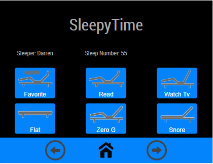

# MMM-TouchSwipe
This is a module for the [MagicMirror²](https://github.com/MichMich/MagicMirror/).

A MagicMirror module for touch screen events to change pages in MMM-Pages. Originally this was coded to capture swipe events, but found it didn't work on the waveshare 3.5" touch screen I designed it for.

Home icon returns user to first page.



sws
### Setup the MagicMirror module
~MagicMirror/modules

git clone https://github.com/buzzkc/MMM-TouchSwipe.git


### Using the module

To use this module, add the following configuration block to the modules array in the `config/config.js` file:
```js
var config = {
    modules: [
        {
              module: "MMM-TouchSwipe",
              position: "bottom_bar",
              config: {
      
              }
        },
    ]
}
```

### Configuration options

| Option            | Description
|-----------------  |-----------
|                   |

## Future ideas
* Add swipe feature indicators

## Thanks To
* MichMich for developing [MagicMirror<sup>2</sup>](https://github.com/MichMich/MagicMirror)
* The [MMM-Pages](https://github.com/edward-shen/MMM-pages) module by Edward Shen
